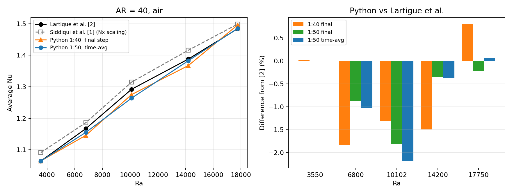

# Natural convection in tall vertical cavities: ACM + FTCS solver in Python

Python (NumPy + Numba) port and validation of my MS-thesis solver. This is Step 1 of a study of
Nusselt-number correlations Nu(Ra, AR) for air-filled tall vertical cavities.

* Original MATLAB code and results: [Natural-Convection-Cavity-Matlab](https://github.com/wajeehasiddiqui831/Natural-Convection-Cavity-Matlab)
* Paper: Siddiqui, Abbas, Akhtar, Khalid, *Nusselt Number Dependence on Aspect Ratio and Rayleigh Number: A Numerical Study of Rayleigh–Bénard Instability*, ASME FEDSM 2022, DOI [10.1115/FEDSM2022-87897](https://doi.org/10.1115/FEDSM2022-87897)
* Credit: the base ACM–FTCS framework was written by my MS supervisor, Prof. Imran Akhtar (NUST). I added the
  post-processing, ran the parametric study, and wrote this Python port.

## Status

| Step | What | State |
|---|---|---|
| 1 | Python port of the MATLAB solver | done |
| 2 | Validation at AR = 40 against Lartigue et al. | done (steady case within 0.03%; time-averaged unsteady cases within 2.2%) |
| 3 | Large case matrix (AR and Ra sweep), saved to CSV | planned |
| 4 | Piecewise empirical correlations Nu(Ra, AR); comparison with a simple ML regressor | planned |

## Repository contents

| File | Purpose |
|---|---|
| `rb_cavity_acm.py` | Solver module (`run_case`, Nusselt number, plotting helpers) |
| `validate_AR40.py` | Script that reproduces the validation table below |
| `RB_cavity_ACM_Python.ipynb` | Google Colab notebook: solver, quick tests, validation |
| `validation_AR40.png` | Validation figure |

## Problem

Air (Pr = 0.71), 2D cavity of width 1 and height AR, Boussinesq approximation. Cold left wall (T = -0.5),
hot right wall (T = +0.5), adiabatic top and bottom (dT/dY = 0), no-slip walls. Initial state: T = 0, U = V = 0.

## Method

Dimensionless Navier–Stokes and energy equations; pressure coupled by artificial compressibility (beta^2 = 0.6);
explicit FTCS discretisation with the same in-place update order as the MATLAB code; convergence when max|dT| < 1e-8.
Stability of the explicit scheme requires dt <= 0.25 dx^2 sqrt(Ra Pr); dt is reduced as the grid is refined.

## How to run

Open `RB_cavity_ACM_Python.ipynb` in Google Colab and run the cells in order, or:

```python
from rb_cavity_acm import run_case
r = run_case(Ra=3550, AR=40, dt=0.004, pts_per_unit=50)
print(r["Nu_avg_alt"])
```

## Validation at AR = 40

Average Nusselt number on the hot wall, compared with Lartigue et al. [2]. "Siddiqui et al. [1]" is the published
MATLAB result (grid 1:40, Nx scaling, see the note below). Python values use the consistent Nx - 1 scaling.
Grid 1:N means N points per unit length. Differences are relative to [2].

| Ra | [1] Siddiqui et al. | [2] Lartigue et al. | Python 1:40, final step | diff | Python 1:50, final step | diff | Python 1:50, time-avg | diff |
|---|---|---|---|---|---|---|---|---|
| 3550  | 1.0910 | 1.0640 | 1.0643 | +0.03% | 1.0641 | +0.01% | 1.0641 | +0.01% |
| 6800  | 1.1860 | 1.1670 | 1.1456 | -1.83% | 1.1569 | -0.87% | 1.1550 | -1.03% |
| 10102 | 1.3147 | 1.2920 | 1.2751 | -1.31% | 1.2686 | -1.81% | 1.2638 | -2.18% |
| 14200 | 1.4160 | 1.3880 | 1.3673 | -1.49% | 1.3831 | -0.35% | 1.3827 | -0.38% |
| 17750 | 1.4987 | 1.4840 | 1.4959 | +0.80% | 1.4808 | -0.22% | 1.4850 | +0.07% |

dt = 0.004 and 50,000 steps (total time 200) for all Python runs. "Time-avg" is the mean of Nu sampled every 100 steps
over the last 10% of the run (t = 180 to 200).



### How to read this

* **Ra = 3550 (steady flow):** both grids agree with each other and with [2] to within 0.03%.
* **Ra >= 6800 (unsteady, multicellular flow):** the flow does not reach a steady state, so Nu is also reported as a
  time-average over the last 10% of the run. The time-averaged values are close to the final-step values
  (differences of 0.03% to 0.4%), so the final-step values were representative, and they agree with [2] within 2.2%.
  Over all five Ra the mean absolute difference from [2] is 0.7%.
* **Largest difference:** Ra = 10102 (-2.2%). It is below [2] on every grid and sampling choice, so it looks systematic
  rather than noise; possible causes to check against [2] include its Ra definition, thermal boundary conditions and 2D/3D effects.
* Grid 1:50 is used as the production grid for the case matrix.

### Note on the Nusselt scaling

The wall-gradient scale in the original MATLAB code uses Nx. For Lx = 1 the consistent scale is 1/dx = Nx - 1,
so the published values [1] are higher than the consistent ones by the factor Nx/(Nx-1) (2.5% at 1:40).
The Nx - 1 value reproduces [2] at Ra = 3550 and the square-cavity benchmark (de Vahl Davis, Ra = 1000: Nu = 1.118).
Both are returned by the code (`Nu_avg` and `Nu_avg_alt`).

## Limitations

2D only; air only (Pr = 0.71); Ra <= 20,000; one reference at AR = 40; explicit scheme with small time steps;
unsteady cases are sampled values, not steady-state values.

## References

[1] Siddiqui, W., Abbas, Z., Akhtar, I., Khalid, M.S.U. (2022). ASME FEDSM 2022, DOI 10.1115/FEDSM2022-87897.
[2] Lartigue, B., Lorente, S., Bourret, B. (2000). Multicellular natural convection in a high aspect ratio cavity:
experimental and numerical results. Int. J. Heat Mass Transfer 43, 3157–3170, DOI 10.1016/S0017-9310(99)00362-2.

## License

Not yet set (pending permission from the base-code author).
